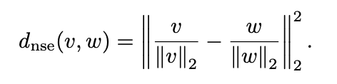

# A Survey on Self-Supervised Representation Learning

TMLR (blind review) 9/14

### Abstract
- 意味のある表現を学習することは最近の機械学習の分野で広く使われている

- また，近年教師なしで表現を学習する手法が数多く提案されている

- 自己教師あり表現学習の精度は教師あり学習の精度に匹敵しつつある (教師ラベルが必要でないのにも関わらず)

### Introduction
- 表現学習の目標はパラメータ $\theta$を持つencoder networkを最適化し，画像から低次元な表現への写像を得ることである

#### self-supervised Learning
- encoderを次の2ステップで学習する
    - 与えられた画像xに対してtargetラベルtを作成し，教師ありタスクを考える
    - xをtにへ移す関数を学習する (教師あり学習)

- tは学習時に変化して良い

#### outline
- section2: auxiliary task (回転している角度を予測するタスクなど) を解く
- section3: information maximization methods
- section4: teacher-student methods
- section5: contrastive learning 
- section6: clustering based method

#### notation
基本的な手法
- 画像Xからencoderによって表現Yを得る
- いくつかの手法では，projection networkを学習し，YからZを得る

他の手法
- 変換t1, t2, ..., tmを定義し，画像Xからtj(X)を得る

など

#### distance metrics and similarity measures
2つのベクトル間の距離を測るために
MSE, 

normalized squared error

cosine similarity

また，次式が成り立つ

2つの分布間の距離を測るために
Cross-Entropy

cross-entropyは三角不等式を満たさない (距離の公理を満たさない)

